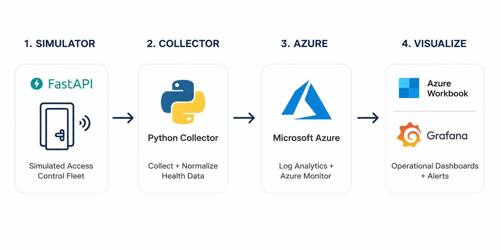
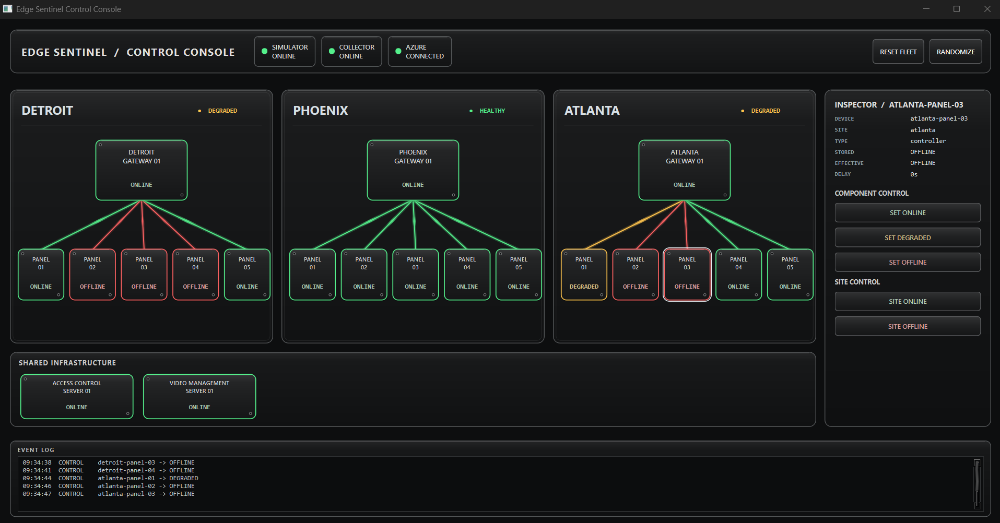
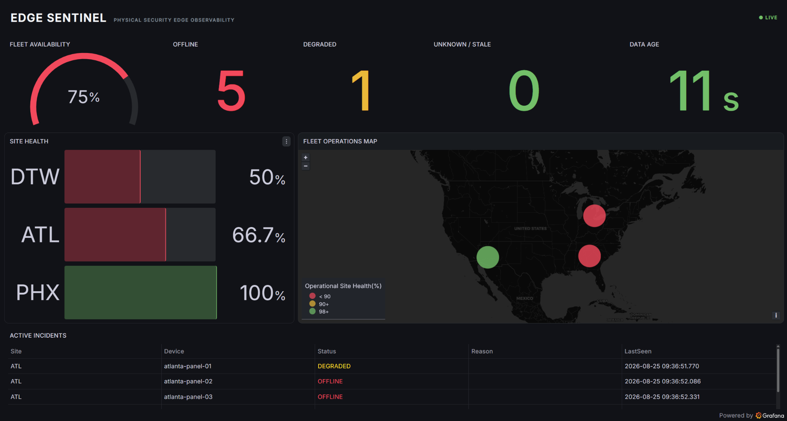
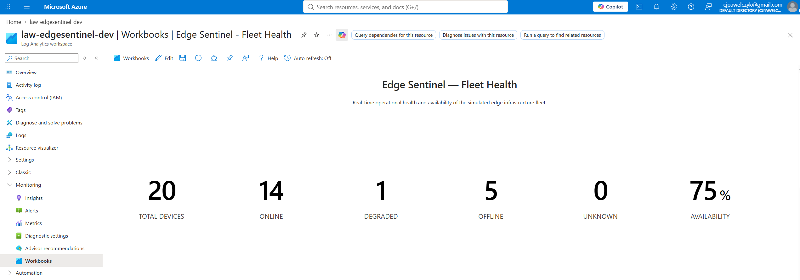
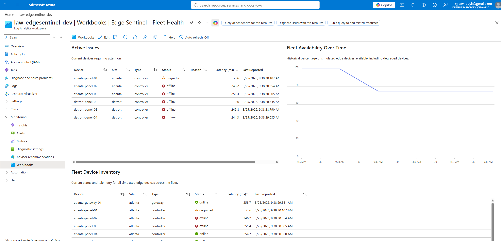
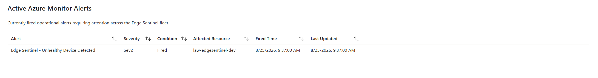
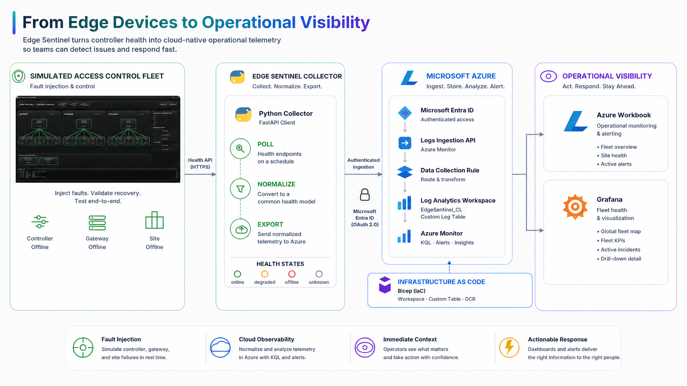

# Edge Sentinel

### Modern observability for physical security infrastructure.

Access control systems can tell you when door controllers have problems. That visibility usually lives inside proprietary access control software that can be clunky, difficult to customize, and disconnected from the observability tools IT teams already use.

**Edge Sentinel moves physical security health beyond the proprietary monitoring layer.**

It collects device health through an API, turns it into a consistent telemetry model, and pipelines it into modern cloud observability tooling. The result is a monitoring experience built around the health of the infrastructure instead of the limitations of the access control application.

Edge Sentinel uses a simulated multi-site access control fleet so failures can be safely injected and observed across the entire monitoring pipeline.

**Python · FastAPI · Azure Log Analytics · Azure Monitor · Grafana · Bicep**

---

## Why I Built It

The idea for Edge Sentinel came from working with enterprise access control systems and repeatedly asking why controller health had to stay locked inside the platform monitoring it.

Enterprise access control platforms like **C•CURE** can monitor door controller health, but getting useful operational visibility from that data isn't always simple. I have to work within the C•CURE GUI, configure proprietary event triggers, and rely on operators viewing those events inside the C•CURE application.

I knew these platforms exposed APIs, so I wanted to take that health **data** out of the box and build the monitoring experience around the data instead of the access control application.

Edge Sentinel is my proof of concept for that approach.

Simulated controller health is collected through an API and normalized into a common health model. That telemetry is securely pipelined into **Azure Log Analytics**, where it can be queried with KQL and used to power Azure Monitor alerts, Azure Workbooks, and Grafana dashboards.

The result is an independent observability layer designed specifically around the health of physical security infrastructure.

---

## How It Works



Edge Sentinel starts with a simulated fleet of access control devices. A Python collector polls the fleet, validates and normalizes the health data, and securely pipelines the resulting telemetry into Azure Log Analytics.

From there, Azure Monitor, Azure Workbooks, and Grafana turn that telemetry into fleet health views, active incident information, alerts, and operational dashboards.

The concept is intentionally simple:

**Simulate → Collect → Normalize → Observe → Respond**

---

## See It in Action

### Simulated Access Control Fleet

Edge Sentinel does not require production access control hardware to demonstrate the monitoring architecture.

A FastAPI-based simulator models a distributed fleet across multiple sites. Each simulated device exposes health information through REST endpoints and can transition between operational states including:

`online` · `degraded` · `offline` · `unknown`

Because the fleet is simulated, failures can be created on demand rather than waiting for real hardware to fail.

### Fault Injection



A **custom-developed control console** provides a simple interface for interacting with the simulated fleet.

Individual controllers can be taken offline or degraded, while larger simulated infrastructure failures can create broader site impact. Devices can then be restored to verify that recovery propagates through the same monitoring pipeline.

This makes it possible to repeatedly test the entire workflow:

**Inject Fault → Collect Health → Normalize Telemetry → Ingest → Detect → Visualize → Recover**

---

## Operational Visibility

Collecting telemetry is only useful if it gives an operator a clear picture of what is happening.

Edge Sentinel uses the same normalized telemetry to create multiple operational views without requiring the operator to return to the access control application.

### Grafana Fleet Operations



The Grafana dashboard provides an at-a-glance view of the simulated fleet, including overall availability, site health, geographic status, and active incidents.

The goal is simple. An operator should be able to open the dashboard and quickly answer:

**Is the fleet healthy? Where is the problem? What failed?**

### Azure Workbook



The Azure Workbook provides a native Azure view of the same telemetry stored in Azure Log Analytics.

KQL queries transform raw health records into current-state operational views, including fleet availability, site health, device status, and active failures.



### Azure Monitor Alerting



Dashboards provide visibility. **Azure Monitor provides detection.**

A scheduled query rule evaluates the telemetry stored in Azure Log Analytics and detects unhealthy devices. When the alert condition is met, Azure Monitor generates an incident independently of the dashboards.

When healthy telemetry is restored and the alert condition clears, the incident automatically resolves.

This means operators do not have to continuously watch a dashboard for Edge Sentinel to identify a problem.

---

## Beyond Proprietary Monitoring

Edge Sentinel is not intended to replace an access control platform.

Enterprise platforms like C•CURE and Lenel still perform the jobs they were designed to do, including managing access control infrastructure, credentials, alarms, doors, and controllers.

Edge Sentinel explores what becomes possible when **physical security data is no longer limited to the application that manages it.**

Controller health is the starting point for this proof of concept, but the same API-driven approach can extend beyond health monitoring. Platform data can be brought into external systems for analytics, visualization, alerting, automation, and integration with broader enterprise workflows.

The access control platform can remain the system of record without requiring it to be the only place its data can create value.

| Native Platform Monitoring | Edge Sentinel Approach |
| --- | --- |
| Health viewed within the access control application | Health available to external observability tools |
| Platform-specific event triggers and configuration | Normalized health states |
| Vendor-defined monitoring experience | Purpose-built operational views |
| Monitoring tied to a specific security platform | Common telemetry model |
| Infrastructure configured manually | Cloud monitoring infrastructure represented as code with **Bicep (IaC)** |

The larger idea goes beyond Azure or Grafana. It is about **taking physical security data beyond the proprietary platform that manages it and putting that data to work wherever it can create the most operational value.**

---

## Technical Architecture



The complete Edge Sentinel pipeline is built from several intentionally simple layers.

### Simulator

**FastAPI** provides REST endpoints representing the health of the simulated access control fleet.

The simulator maintains device state and supports intentional fault injection so failures can be introduced, observed, and restored on demand.

This creates a controlled environment for testing the monitoring architecture without proprietary hardware, SDKs, or access to a production security system.

### Collector

A **Python collector** polls the simulated health APIs and converts responses into a consistent telemetry model.

The collector handles successful responses as well as timeouts, malformed responses, missing data, and other collection failures. Unexpected responses are normalized into known health states rather than being allowed to break the monitoring pipeline.

Normalized records preserve operational context including device, site, component type, status, failure reason, and collection timing.

### Azure Ingestion

The collector authenticates using **Microsoft Entra ID** and securely pipelines normalized telemetry through the **Azure Monitor Logs Ingestion API**.

A **Data Collection Rule (DCR)** defines the ingestion path into the custom `EdgeSentinel_CL` table in Azure Log Analytics.

The identity running the collector is granted the least-privilege `Monitoring Metrics Publisher` role on the Data Collection Rule.

Azure Log Analytics then becomes the central telemetry store for the monitoring environment.

### Query & Detection

**Kusto Query Language (KQL)** turns the telemetry stored in Azure Log Analytics into current operational state.

Queries are used to:

- determine the latest health state of each device
- calculate fleet availability
- identify active failures
- aggregate health by site
- provide data for Azure Workbooks
- drive Azure Monitor alert detection
- supply telemetry to Grafana

This allows the same underlying telemetry to support multiple operational experiences without creating separate monitoring pipelines for each one.

### Visualization

**Azure Workbooks** provide native visualization inside Azure Monitor.

**Grafana** connects to Azure Log Analytics to provide a dedicated fleet operations dashboard built around physical security infrastructure health.

Both consume the same normalized telemetry while presenting it differently based on the operational use case.

---

## Infrastructure as Code

The Azure implementation is represented as **Bicep (IaC)**.

The Bicep deployment defines the core telemetry infrastructure used by Edge Sentinel, including:

- Azure Log Analytics workspace
- custom `EdgeSentinel_CL` table
- Data Collection Rule
- logs ingestion configuration

This means the Azure foundation does not exist only as a collection of manually configured portal resources.

The infrastructure can be **reviewed, versioned, reproduced, and safely changed from code.**

Azure's `what-if` capability can also preview proposed infrastructure changes before deployment, allowing the Bicep configuration to be compared against the environment already running in Azure.

### Validate

```powershell
az bicep build --file .\infrastructure\bicep\main.bicep
```

### Preview Changes

```powershell
az deployment group what-if `
  --resource-group rg-edgesentinel-dev `
  --template-file .\infrastructure\bicep\main.bicep `
  --parameters .\infrastructure\bicep\parameters.dev.json
```

### Deploy

```powershell
az deployment group create `
  --resource-group rg-edgesentinel-dev `
  --template-file .\infrastructure\bicep\main.bicep `
  --parameters .\infrastructure\bicep\parameters.dev.json
```

---

## Reliability & Testing

A monitoring system needs to behave predictably when the systems it monitors do not.

Edge Sentinel includes automated tests covering simulator behavior, health collection, response normalization, fault handling, and Azure export behavior.

Run the test suite from the repository root:

```powershell
python -m pytest
```

The collector is designed to tolerate unexpected conditions. A malformed response, unavailable endpoint, or Azure ingestion failure should not terminate the overall collection cycle.

Fault injection adds end-to-end validation on top of the automated test suite.

Instead of only testing individual functions, a failure can be deliberately introduced into the simulated fleet and followed through the complete operational pipeline:

**Fault → API → Collector → Azure Log Analytics → Detection → Dashboard → Recovery**

---

## Repository Structure

```text
EdgeSentinel/
├── docs/
│   ├── design/             # Project design documentation
│   ├── images/             # README diagrams and project screenshots
│   ├── queries/            # KQL queries
│   └── workbooks/          # Azure Workbook definition
├── grafana/
│   └── dashboards/         # Grafana dashboard definition
├── infrastructure/
│   └── bicep/              # Azure infrastructure as code
├── src/
│   ├── collector/          # Health collection, normalization, and Azure export
│   ├── control_console/    # Fault injection and demonstration console
│   └── simulator/          # FastAPI simulated infrastructure
├── tests/                  # Automated test suite
├── .env.example            # Azure configuration template
├── LICENSE
└── README.md
```

---

## Running Edge Sentinel

Edge Sentinel can run as a local simulated environment without requiring physical access control hardware.

### 1. Create the Python Environment

From the repository root:

```powershell
py -m venv .venv
.\.venv\Scripts\Activate.ps1
```

Install the component dependencies:

```powershell
python -m pip install -r src\simulator\requirements.txt
python -m pip install -r src\collector\requirements.txt
python -m pip install -r src\control_console\requirements.txt
```

### 2. Launch the Control Console

```powershell
python -m src.control_console.main
```

The Control Console can be used to start the local demonstration environment and inject faults into the simulated fleet.

### 3. Start the Simulator Manually

```powershell
python -m uvicorn main:app --app-dir src\simulator --reload
```

### 4. Start the Collector Manually

One collection pass:

```powershell
python src\collector\main.py --once
```

Continuous polling:

```powershell
python src\collector\main.py
```

### 5. Enable Azure Export

Copy the configuration template:

```powershell
Copy-Item .env.example .env
```

Configure the Azure ingestion values required by the collector, authenticate with Azure, and run:

```powershell
python src\collector\main.py --azure
```

### 6. Run the Deterministic Scenario

With the simulator and collector running:

```powershell
python src\simulator\run_scenario.py
```

This provides a reproducible fault and recovery sequence for observing the monitoring pipeline end to end.

---

## Project Scope

Edge Sentinel is a **proof of concept**, not a production access control integration.

The current implementation uses simulated infrastructure rather than connecting to a live C•CURE, Lenel, or other enterprise access control environment.

That is intentional.

The simulator provides a controlled environment where faults can be created on demand and the entire monitoring pipeline can be validated repeatedly without proprietary hardware, SDKs, credentials, or production systems.

A production implementation could replace the simulated health API with data obtained through supported platform APIs or integration interfaces while retaining the same overall architecture:

**Collect → Normalize → Ingest → Query → Detect → Visualize**

---

## What This Project Demonstrates

### Physical Security Engineering

Enterprise access control infrastructure, controller monitoring, fault scenarios, and the operational challenges of proprietary physical security platforms.

### Software Engineering

Python, FastAPI, REST APIs, telemetry normalization, failure handling, automated testing, and fault simulation.

### Cloud Engineering

Microsoft Entra ID authentication, Azure Monitor Logs Ingestion API, Data Collection Rules, Azure Log Analytics, KQL, Azure Monitor, and Azure Workbooks.

### Observability

Health modeling, fleet availability, current-state queries, incident detection, alerting, operational dashboards, and Grafana visualization.

### Infrastructure as Code

Bicep templates for versioning and reproducing the Azure telemetry foundation.

---

## The Goal

Edge Sentinel started with a simple idea:

**Physical security data should not have to stop at the boundary of the platform that manages it.**

Controller health is the proof of concept. The broader architecture demonstrates how API-accessible physical security data can move beyond proprietary tooling and into systems designed for monitoring, analytics, automation, and integration.

The goal is not to replace the access control platform.

**It is to take the data beyond it and put that data to work.**
